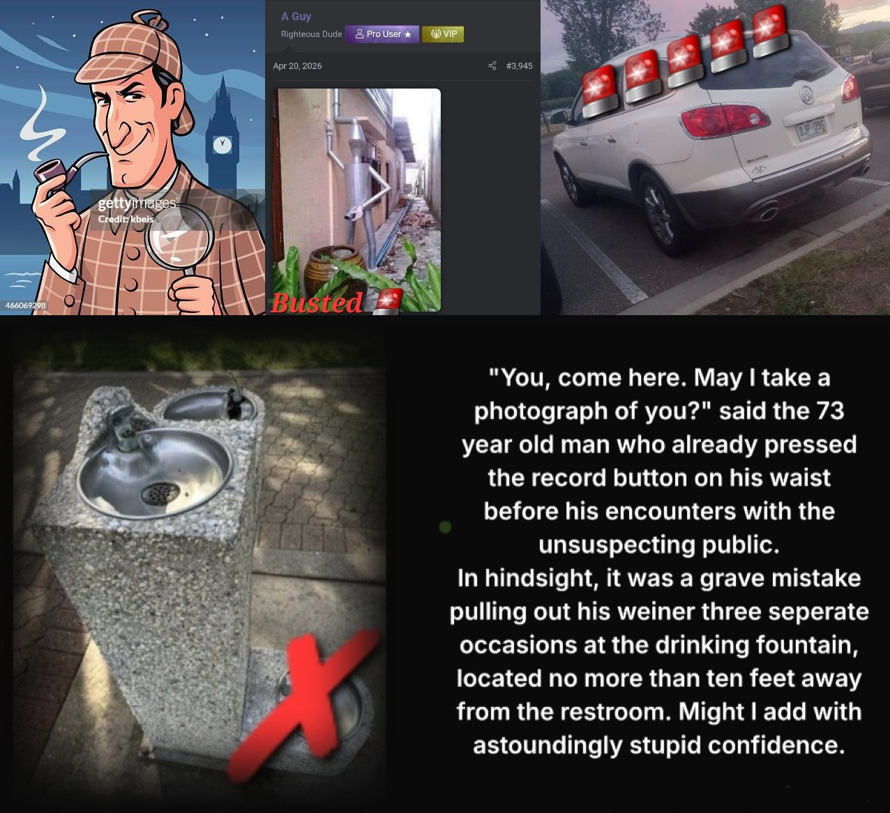

# On the surface
***Flags your professional life is being targeted***

***This is what a professional hitjob looks like. This could potentially be nation state actors, third party professionals, or even a corporation***

# Deep below
***Flags your circle has been social engineered***
- 1. Old friends, acquaintances, exces, contacting you to glean information. It may be a just little chat to start. Things might get weird later. Anything obtained about you whether it be real, fake, or perceived, will be used to spider their way through your network.
- 2. Don't wait. Friends, family, roommates, or even coworkers who could have been a witness, can now be blackmailed after their participation.
- 3. You've waited too long. At this point it's self preservation. They must continue to harass or collect information on you, or else.
- 4. There's a new kind of unpersoning, and it's more sinister than you think. They could be attacking your social circle so there's nobody left to speak up when your reputation is under assault. Since they cannot erase the past, the next best thing is neutralizing the witnesses. For example, let's say you were ***the*** stud or mister popular throughout your college years. Simple facts such as this diametrically opposes and would unravel the narrative of you being a 'McLovin' or a 'creepy Cameron'. Likely these are precisely the archetypes belonging to the individuals who are doing the attacking. Ironic but not surprising. ***Stay in touch with old friends, especially if you notice something is not right.***
- 5. Strange new friend requests, or even stranger requests from established friends? What about that old buddy who's been pushing daisies for 8 years hovering to the top of your friends list? Let the culling begin.
- 6. Social media oddities. News feed from hell? No matter how many times you remove the schit it keeps coming back. Don't be disappointed after you find out it isn't the apps platform.
- 7. Feeling sensitized? Seeing same or similar keywords or user handles on a particular site, over and again with slight variances relating to ongoing threats, a loved ones death, past relationships, or any traumatic experience? The internet is a vast place, giving room for plausible deniability. Don't wait, start collecting evidence until denial is no longer plausible.
- 8. Gaslighting. A bit of skepticism is healthy, but not when it comes to this. They are ruining your life, one person at a time.
- 9. Fake Dexters. Nobody plays the 'good guys' better than the bad ones. A frequently used exploit making it permissible to do what they do, but in the light with a captive audience. Sometimes things go wrong. Imagine a case of mistaken identity, then having to justify ruining a person's life, it happens.
- 10. Overton window breakers. Imagine having a set of specific circumstances you are dealing with. On the verge of reporting these 'issues' online, you notice fresh and active people with your same exact circumstances, all over the place. Except they're making it look ridiculous. You got beat to the punch.
- 11. Theft of course. Money, assets, or even government benefits stolen, but it doesn't stop there.
- 12. Weaponization of your vicinity. Imagine busting a housemate creeping around your room while you sleep. Mind you, the ***only*** three times you forgot to lock your room. What about waking up to phones and tablets slid underneath your door, wedged up with the camera pointed right towards your bed. Or how about being told you're being recorded on a semi-weekly basis? This was my life for nearly two years. Oh the things you'll put up with for cheap rent, but it may be costing you more than you realize.
- 13. Paid stalkers and paparazzi. Have a favorite place you eat at, or what about a trail you visit? We're not talking social experiments, but more along the lines of malicious surveillance. Unironically these risk-taking voyeur types are prone to making blatantly idiotic mistakes. Reports were promptly filed with the police.
- 14. Coming home to disaster. Every single cord in the entire house has been physically severed in half. Electrical, ethernet, telephone, audio, and cable. Your home has the potential to be used as a warzone to wreck havoc upon you, or anyone else in the vicinity. Several reports were immediately filed with the police.

# Destroying the remnants of normalcy in a person's life achieves what exactly? 
- ***A recipe for making monsters through destabilization (of course)***

- By the time you notice that anything remotely resembling regular conversation with friends or family is now a past-time, it's too late.

# Public stalking, oddities, and harassment
- Without getting into the uncomfortable scenerios I've encountered or various strangers who've approached me in public since becoming a developer of operating system deployment tools, I'll say this - it's been unnerving. Here we have a gentleman that seemed alright at first glance, though looks can be deceiving. Sometimes you may have to take matters into your own hands, especially when they've been persistent after making it abundantly clear to leave you alone. What a creep. 

## Your names will be revealed and made public, even if it's the last thing I do

- Every single online community knows ***exactly*** who's responsible, and the truth will eventually come out. In the meantime, your communities can look like the disgusting shite that they are.
- For anyone who's wondering, and I'm sure there's quite a few, the ***only*** legal trouble I've been in within nearly the past two decades is a ticket for expired plates. That's it.

# Getting to the heart of the matter

***Remember this, only complete losers who weren't able to achieve satisfaction in life thrive on destroying others' lives. That's a fact.***

- What's your point? And what do your competitors and/or their affiliated websites have to do with any of this?

***Absolutely, positively, everything and a bag of chips. Welcome to the post-apocalyptic world of software engineering. Think twice before opening the door***
